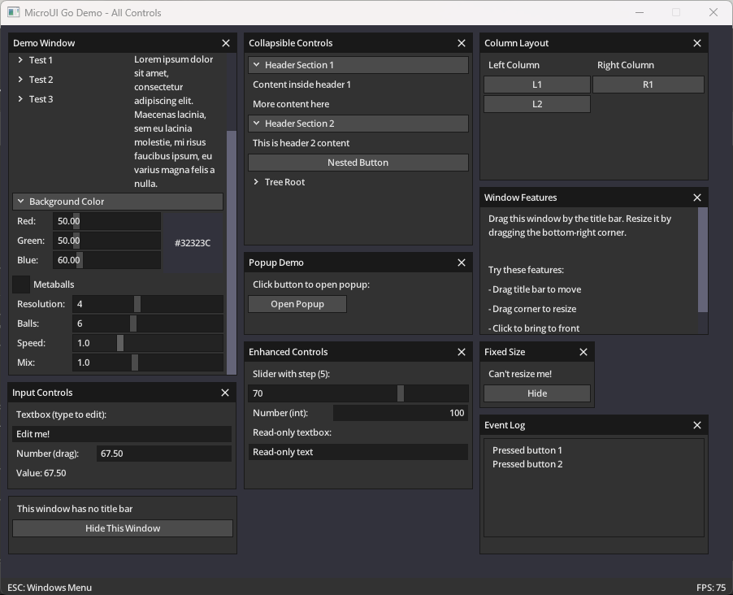
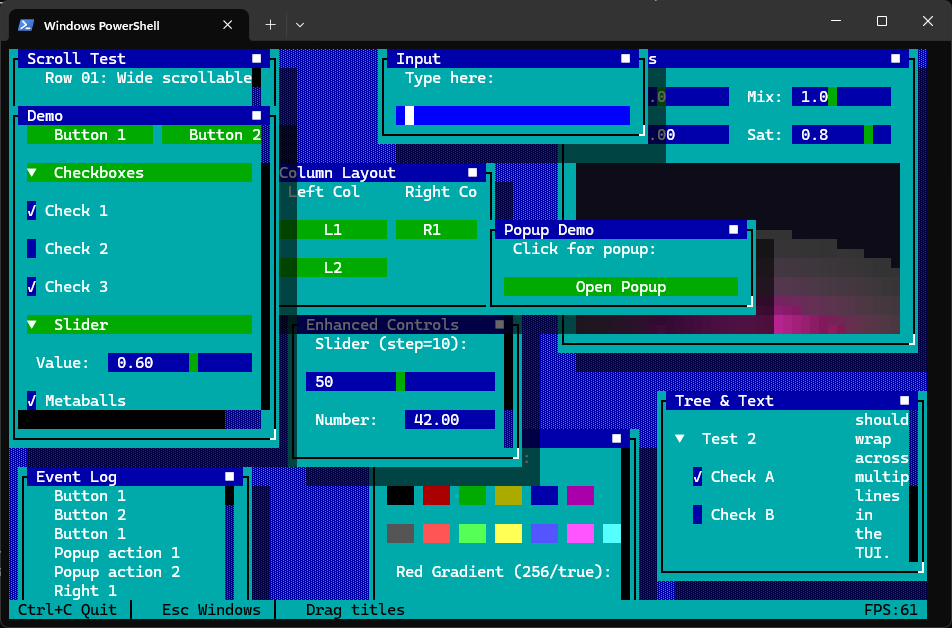

# microui-go
A Go port of [rxi/microui](https://github.com/rxi/microui) — a tiny, portable, immediate-mode UI library.

**[Live Demo](https://damiensgit.github.io/microui-go/examples/wasm-demo/)** — try it in your browser

| GUI (Ebiten) | TUI (Bubble Tea) |
|:---:|:---:|
|  |  |

## Features
* Faithful port of the original C implementation (~2500 sloc of Go)
* No memory allocation per frame — uses pre-allocated command buffers
* Built-in controls: window, button, slider, textbox, checkbox, label, and more
* Flexible layout system with rows, columns, and automatic sizing
* WebAssembly support — runs in browsers with WASM-compatible renderers
* **Batteries included**: two reference renderers ready to use

## Renderers

### Ebiten (GUI)
Full-featured renderer using [Ebiten](https://ebitengine.org/) for desktop/mobile/web:
* Hardware-accelerated rendering
* Bitmap font from the original microui atlas
* Mouse and keyboard input handling
* Compiles to WebAssembly for browser deployment
* See `examples/ebiten-demo` and `examples/wasm-demo`

### Bubble Tea (TUI)
Terminal renderer using [Bubble Tea v2](https://github.com/charmbracelet/bubbletea):
* Cell-based rendering for any terminal
* Unicode icons and box drawing
* Mouse support in capable terminals
* See `examples/bubbletea-demo`

The TUI renderer is primarily a demonstration of microui's flexibility — immediate-mode GUIs map surprisingly well to terminal cells. That said, terminal UIs have different constraints and idioms; for serious TUI work, purpose-built libraries like Bubble Tea's component model are usually more practical.

## Usage

```go
import (
    "github.com/user/microui-go"
    "github.com/user/microui-go/types"
)

ui := microui.New()

// Each frame:
ui.BeginFrame()

if ui.BeginWindow("My Window", types.Rect{X: 10, Y: 10, W: 300, H: 200}) {
    ui.LayoutRow(2, []int{100, -1}, 0)

    ui.Label("Name:")
    ui.Textbox(&nameBuf)

    if ui.Button("Submit") {
        // handle click
    }

    ui.EndWindow()
}

ui.EndFrame()

// Render commands with your renderer
ui.Render(renderer)
```

## How It Works
The library handles input and produces drawing commands — it does not render anything itself. You provide mouse/keyboard state each frame, build your UI with immediate-mode calls, then iterate the command buffer to draw rectangles, text, and icons however you like.

This keeps the core small and renderer-agnostic. The included Ebiten and Bubble Tea renderers show two very different approaches to the same command stream.

## Differences from C microui

For those familiar with the [original C implementation](https://github.com/rxi/microui):

| Aspect | C microui | microui-go |
|--------|-----------|------------|
| API style | `mu_begin_window(ctx, ...)` | `ui.BeginWindow(...)` |
| Context | Explicit `ctx` parameter | Methods on `UI` struct |
| Memory | Fixed arrays, manual sizing | Go slices, growing pools |
| Strings | C strings with length | Go strings |

**What's the same:**
* Command buffer architecture
* Layout system and behavior
* Control set and options
* `DrawFrame` callback for custom control chrome
* Font callbacks / interface for custom metrics
* 14-color theme system

**Additions in Go version:**
* Ready-to-use renderers (Ebiten for GUI, Bubble Tea for TUI)
* WebAssembly support via Ebiten

## Building the Demos

```bash
# GUI demo (desktop)
cd examples/ebiten-demo
go build
./ebiten-demo

# TUI demo (terminal)
cd examples/bubbletea-demo
go build
./bubbletea-demo

# WASM demo (browser)
cd examples/wasm-demo
go run serve.go
# Opens http://localhost:8080
```

To rebuild the WASM binary:
```bash
cd examples/ebiten-demo
GOOS=js GOARCH=wasm go build -o ../wasm-demo/main.wasm .
```

## License
MIT License — same as the original microui.

## Credits
* [rxi](https://github.com/rxi/microui) for the original microui
* [Ebiten](https://ebitengine.org/) and [Bubble Tea](https://github.com/charmbracelet/bubbletea) projects
